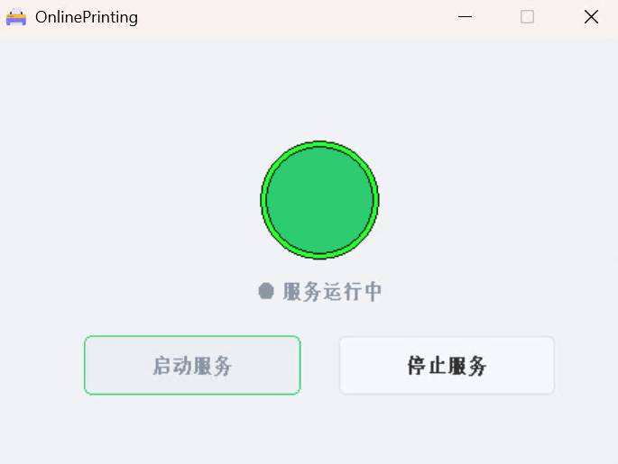

# OnlinePrinting

一个基于 Python FastAPI 的在线文档打印管理系统，将本地打印机在局域网或互联网上公布，支持用户通过浏览器上传、管理、转换和打印文档。

---

## 目录

- [功能特性](#功能特性)
- [界面截图](#界面截图)
- [技术栈](#技术栈)
- [项目结构](#项目结构)
- [快速开始](#快速开始)
- [配置说明](#配置说明)
- [API 概览](#api-概览)
- [打包部署](#打包部署)
- [许可证](#许可证)

---

## 功能特性

### 文件管理
- **上传**：支持 PDF / DOC / DOCX / XLS / XLSX 格式，单文件上限 100MB
- **文件浏览**：面包屑导航，按用户隔离目录，支持新建文件夹、重命名、删除
- **下载**：在线下载已上传的文件

### 文档打印
- **串行打印队列**：后台守护线程按 FIFO 顺序处理打印任务，避免并发冲突
- **丰富的打印设置**：纸张方向（纵向/横向）、双面打印（长边/短边翻转）、色彩模式（彩色/黑白）、缩放、纸张尺寸、进纸托盘、页面布局（含小册子模式）
- **PDF 打印**：基于 SumatraPDF 命令行工具，支持精细参数控制
- **Office 打印**：通过 pywin32 COM 接口调用本地 Microsoft Word / Excel 打印

### 文档转换
- **Word / Excel → PDF**：利用 COM 接口将 Office 文档转换为 PDF，便于统一打印管理

### 用户系统
- **注册与登录**：JWT Token 认证（HS256，24 小时有效），bcrypt 密码哈希
- **角色权限**：超级管理员（首位注册用户）、管理员、普通用户三级角色
- **强制改密**：管理员重置密码后，用户登录时强制修改初始密码
- **账号管理**：禁用/启用账号、修改显示名称与密码

### 管理后台
- **用户管理**：查看用户列表、设置/撤销管理员、重置密码、禁用/启用、删除用户
- **操作审计**：全量操作日志记录，支持按用户名筛选和分页查询

### 自动清理
- 每天凌晨 4 点自动清理超过 30 天的临时文件，保持磁盘空间

---

## 界面截图

### 登录页


### 注册页


### 主界面 — 文件管理 + 打印操作


### 文件上传


### 高级打印设置


### 个人信息


### Windows 原生控制面板


---

## 技术栈

| 层级       | 技术                                                |
| ---------- | --------------------------------------------------- |
| 后端框架   | FastAPI + Uvicorn                                   |
| GUI 面板   | win32gui（原生 Windows API 绘制）                    |
| 认证       | JWT (HS256) + bcrypt                                |
| 数据存储   | JSON 文件（线程安全）                                |
| Office 操作 | pywin32 (win32com + win32print)                     |
| PDF 打印   | SumatraPDF 命令行                                    |
| 前端       | 原生 HTML / CSS / JS，Neumorphism 拟态设计           |
| 图标       | Remix Icon                                          |
| 打包       | PyInstaller                                         |

---

## 项目结构

```
OnlinePrinting/
├── main.py                  # FastAPI 应用入口，挂载路由与静态文件
├── gui.py                   # Windows 原生 GUI 控制面板
├── build.py                 # PyInstaller 打包脚本
├── version.txt              # 版本信息文件
├── api/                     # API 路由层
│   ├── auth.py              #   认证接口（登录 / 获取用户信息）
│   ├── user.py              #   用户管理接口（CRUD / 改密）
│   ├── admin.py             #   管理员接口（权限管理 / 日志查询）
│   ├── upload.py            #   文件管理接口（上传 / 下载 / 删除）
│   ├── printfile.py         #   打印接口（队列 / 打印机管理）
│   └── topdf.py             #   转 PDF 接口
├── core/                    # 核心基础设施层
│   ├── config.py            #   全局配置
│   ├── store.py             #   JSON 文件存储（用户 + 日志）
│   ├── utils.py             #   工具函数（JWT / 密码 / 权限验证）
│   ├── schemas.py           #   Pydantic 数据模型
│   ├── logger.py            #   日志记录
│   └── cleaner.py           #   定时文件清理
├── office/                  # Office 文档处理层
│   ├── print_office.py      #   Word / Excel 打印（pywin32 COM）
│   └── topdf.py             #   Word / Excel → PDF 转换
└── static/                  # 前端静态资源
    ├── index.html           #   主界面（文件管理 + 打印）
    ├── admin.html           #   管理后台
    ├── login.html           #   登录页
    ├── register.html        #   注册页
    ├── profile.html         #   个人信息页
    ├── change-password.html #   强制改密页
    ├── common.js            #   公共 JS 工具
    ├── style.css            #   全局样式
    └── favicon.ico           #   图标
```

---

## 快速开始

### 环境要求

- **Windows** 操作系统（依赖 pywin32 和 COM 接口）
- **Python** 3.10+
- **Microsoft Office**（Word / Excel 打印和转 PDF 需要）
- **SumatraPDF**（PDF 打印需要，可在 `office/` 目录下放置 `SumatraPDF.exe`）

### 安装依赖

```bash
pip install fastapi uvicorn pywin32 bcrypt pyjwt pydantic python-multipart email-validator
```

### 启动服务

#### 方式一：GUI 面板启动（推荐）

```bash
python gui.py
```

打开 Windows 原生控制面板，点击 **"启动服务"**，FastAPI 将在后台启动。

#### 方式二：命令行直接启动

```bash
python main.py
```

或使用 uvicorn：

```bash
uvicorn main:app --host 0.0.0.0 --port 8080
```

### 访问系统

启动后在浏览器中打开：

- **本地访问**：http://127.0.0.1:8080
- **局域网访问**：http://你的IP:8080（需确保防火墙开放 8080 端口）

首次访问会自动跳转到登录页，新用户可点击注册。**第一个注册的用户自动成为超级管理员**。

---

## 配置说明

核心配置位于 `core/config.py`，主要配置项：

| 配置项            | 默认值        | 说明                               |
| ----------------- | ------------- | ---------------------------------- |
| `ServerHost`      | `0.0.0.0`     | 服务监听地址                       |
| `ServerPort`      | `8080`        | 服务监听端口                       |
| `SecretKey`       | 随机生成       | JWT 签名密钥                       |
| `FilesPath`       | `files/`      | 用户文件存储目录                   |
| `Retention_Days`  | `30`          | 文件保留天数，超过自动清理         |

### SumatraPDF 配置

将 SumatraPDF 可执行文件（推荐 SumatraPDF-3.6.1-64.exe）放置于 `office/` 目录下，或修改 `core/config.py` 中的 `SumatraPDF` 路径。

---

## API 概览

| 方法   | 路径                          | 说明               | 认证要求     |
| ------ | ----------------------------- | ------------------ | ------------ |
| POST   | `/api/auth/login`             | 用户登录           | 否           |
| GET    | `/api/auth/me`                | 获取当前用户信息   | JWT Token    |
| POST   | `/api/users/create`           | 注册新用户         | 否           |
| GET    | `/api/users/list`             | 用户列表           | 管理员       |
| PUT    | `/api/users/update/{id}`      | 更新用户           | 管理员       |
| DELETE | `/api/users/{id}`             | 删除用户           | 管理员       |
| POST   | `/api/users/reset-password/{id}` | 重置用户密码    | 管理员       |
| POST   | `/api/users/change-password`  | 修改自己的密码     | JWT Token    |
| PUT    | `/api/users/me/update`        | 更新个人信息       | JWT Token    |
| POST   | `/api/admin/set-admin`        | 设置/撤销管理员    | 超级管理员   |
| GET    | `/api/admin/logs`             | 操作日志（分页）   | 管理员       |
| GET    | `/api/files/list`             | 文件列表           | JWT Token    |
| POST   | `/api/files/upload`           | 上传文件           | JWT Token    |
| GET    | `/api/files/download`         | 下载文件           | JWT Token    |
| POST   | `/api/files/delete`           | 删除文件           | JWT Token    |
| POST   | `/api/files/mkdir`            | 新建文件夹         | JWT Token    |
| POST   | `/api/files/rename`           | 重命名文件         | JWT Token    |
| GET    | `/api/print/printers`         | 获取打印机列表     | JWT Token    |
| POST   | `/api/print/file`             | 打印单个文件       | JWT Token    |
| POST   | `/api/print/batch`            | 批量打印           | JWT Token    |
| GET    | `/api/print/queue-status`     | 打印队列状态       | JWT Token    |
| POST   | `/api/topdf/convert`          | Word/Excel 转 PDF  | JWT Token    |

---

## 打包部署

项目提供 `build.py` 打包脚本，使用 PyInstaller 将应用打包为 Windows 单目录可执行文件。

```bash
python build.py
```

打包完成后，所有输出文件位于 `dist/OnlinePrinting/` 目录。该目录可直接分发，双击 `OnlinePrinting.exe` 即可启动 GUI 控制面板。

打包特性：
- 无控制台窗口（`--noconsole`）
- 自动收集 `api` / `core` / `office` 子模块
- 自动复制 `static/` 静态资源和 `SumatraPDF.exe` 到输出目录

---

## 许可证

本项目基于 [MIT License](LICENSE) 开源。

Copyright © 2026 江城月下

---

## 数据流架构

```
浏览器 (static/*.html)
    │  HTTP/REST API
    ▼
FastAPI (main.py)
    ├── /api/auth/*     → JWT 认证 ──────────→ core/store.py (users.json)
    ├── /api/users/*    → 用户 CRUD ──────────→ core/store.py
    ├── /api/admin/*    → 管理员操作 ──────────→ core/store.py (logs.json)
    ├── /api/files/*    → 文件管理 ──────────→ files/{用户}/ 目录
    ├── /api/print/*    → 打印队列 ──────────→ office/print_office.py (Word/Excel)
    │                    │                     SumatraPDF.exe (PDF)
    │                    │                     win32print (打印机管理)
    └── /api/topdf/*    → 转PDF ────────────→ office/topdf.py (Word/Excel COM)

后台任务:
    core/cleaner.py ─→ 每天 04:00 清理过期文件
```
